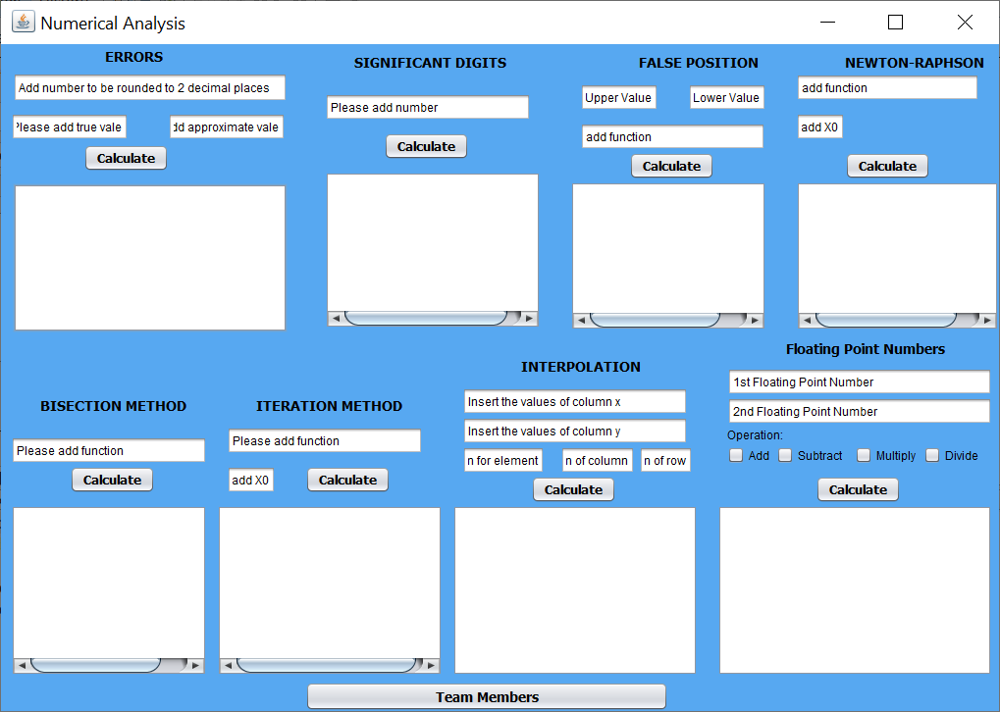

# Numerical Analysis Algorithms Implementation

## Software Description
- The project is written in Java.

- The application implements the following:
  - Ronding Numbers.
  - Calculating Errors.
  - Finding Significant Digits.
  - False Position Method.
  - Newton Raphson Method.
  - Bisection Method.
  - Iteration Method.
  - Interpolation Method.
  - Operations on Floating Numbers Representation.
  
## Screenshot
  
  
